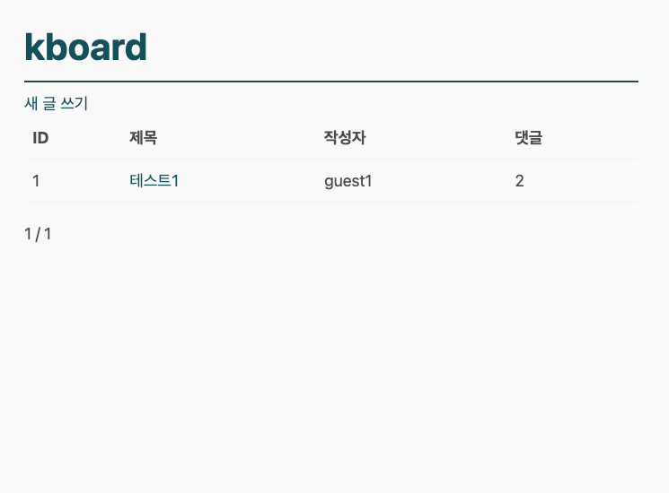
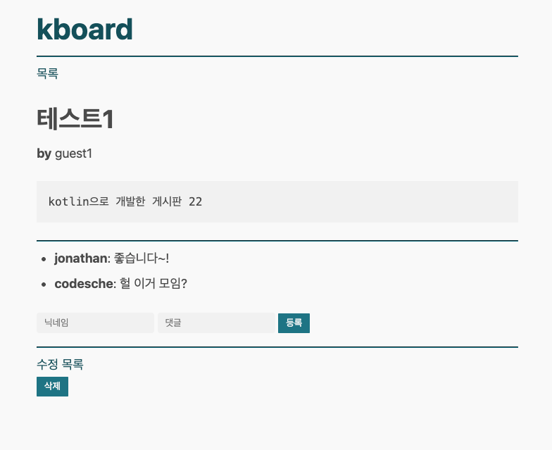
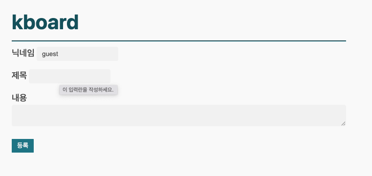
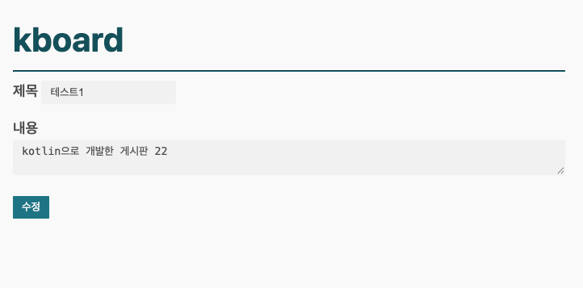

# 📘 KBoard - Kotlin Spring Boot 게시판 프로젝트

KBoard는 **Kotlin + Spring Boot + Thymeleaf + H2 DB** 기반으로 개발된 간단한 게시판 애플리케이션입니다.  
회원(Member), 게시글(Post), 댓글(Comment) 도메인을 중심으로 CRUD와 연관관계 매핑, JPA 영속성 전이를 다루며, 학습 및 실습용으로 적합합니다.

---

## 🚀 실행 방법

### 1. 프로젝트 클론 및 의존성 설치
```bash
git clone <your-repo-url>
cd kboard
./gradlew clean build
```

### 2. 애플리케이션 실행
```bash
./gradlew bootRun
```

애플리케이션은 기본적으로 **http://localhost:8080** 에서 실행됩니다.

### 3. H2 콘솔 접속 (테스트 DB 확인)
```
http://localhost:8080/h2-console
```
- JDBC URL: `jdbc:h2:mem:kboard`
- User: `sa`

---

## 📂 주요 기능

1. **게시판 목록 조회**
    - 작성자 닉네임, 댓글 수 함께 표시
    - 페이징 처리

   

2. **게시글 상세 보기**
    - 게시글 내용 표시
    - 댓글 목록 + 댓글 작성 기능
    - 수정, 삭제 기능 포함

   

3. **게시글 작성**
    - 닉네임, 제목, 내용 입력 후 게시글 등록

   

4. **게시글 수정**
    - 기존 제목/내용 불러오기 → 수정 후 반영

   

---

## 🛠 개발 과정 (Troubleshooting 포함)

1. **초기 설정**
    - Spring Boot 3.x + Kotlin 프로젝트 생성
    - H2 DB, Spring Data JPA, Thymeleaf 의존성 추가

2. **도메인 모델링**
    - `Member`, `Post`, `Comment` 엔티티 작성
    - 연관관계 매핑: Post ↔ Comment (1:N), Post ↔ Member (N:1)

3. **JPA 오류 해결 과정**
    - `TransientPropertyValueException`: `cascade = PERSIST` 옵션 추가로 해결
    - `No default constructor`: Kotlin 엔티티에 `protected constructor()` 추가
    - DTO ↔ 엔티티 변환 구조 정립 (`PostResponse`, `PostCreateRequest` 등)

4. **View & Controller**
    - Thymeleaf 템플릿 작성 (`list.html`, `detail.html`, `form.html`)
    - PostController, CommentController 구현
    - EL 오류 해결 (`post.author.nickname` → `post.authorNickname` DTO 기반 수정)

5. **최종 UI 확인**
    - 목록, 상세, 작성, 수정, 삭제, 댓글 CRUD 전부 정상 동작
    - 스크린샷으로 동작 결과 기록

---

## 📸 실행 화면

- **게시판 목록**  
  

- **게시글 상세**  
  

- **게시글 작성**  
  

- **게시글 수정**  
  

---

## ✅ 마무리

이번 프로젝트를 통해 학습한 내용:
- Kotlin + Spring Boot 기반 JPA 사용법
- 엔티티 간 연관관계 및 영속성 전이 문제 해결
- DTO 변환 및 Controller-View 데이터 전달 구조
- Thymeleaf 기반 서버 사이드 렌더링

